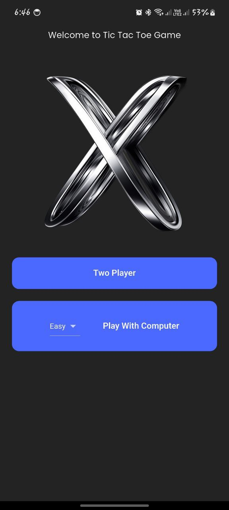
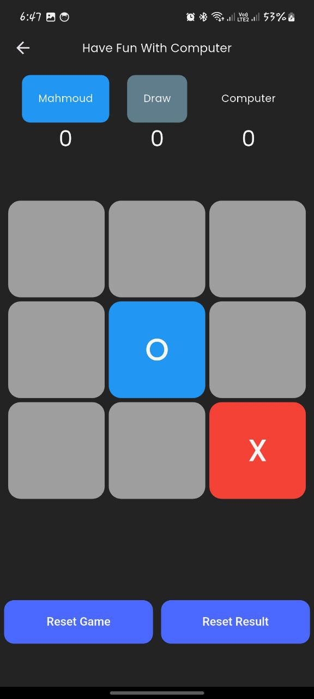
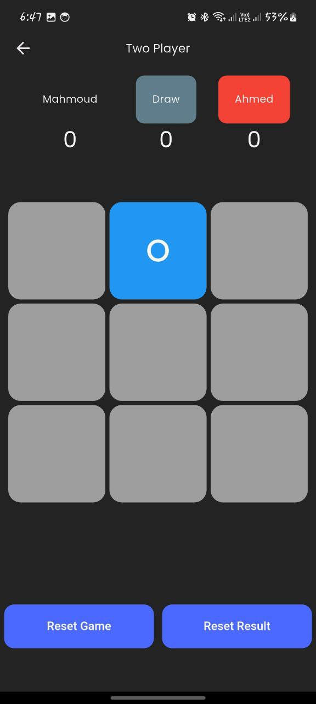

# ❌⭕ Tic Tac Toe - Flutter Game

A classic **Tic Tac Toe** game made using **Flutter**, featuring a clean UI, sound effects, and responsive layout.
---

## 🎮 Features

- Two Player Mode (PvP on same device)
- Simple and clean game UI
- Reset & replay functionality
- No ads, 100% free

---

## 🚀 Tech Stack

- Flutter 💙
- GetX for state management
- Dart OOP principles
- Responsive design

---

## 📷 Screenshots

| Welcome Screen | Computer | Two Player |
|------------|---------|------------|
|  |  |  |

---

## 📥 Download APK

Install it on your Android device:  
📱 **[Download APK](https://drive.google.com/file/d/1k0-1t96tmNWv3cbzIa6SQ4N4lVs9BK3L/view?usp=drive_link)**

---
